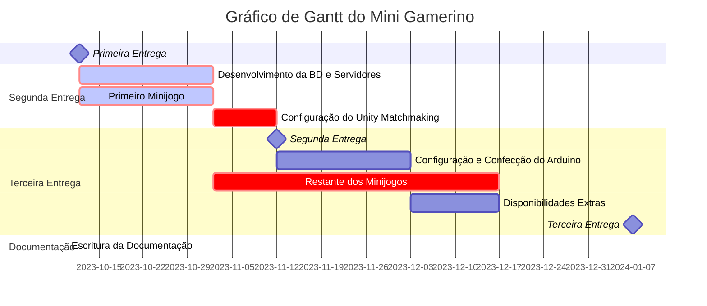

# Projeto Desenvolvimento Software
#### Docente André Sabino

# MiniGamerino
### 19/11/2023

1. ### Duarte Cavaleiro nº20211026
2. ### Francisco Santos nº20211206
3. ### Marco Camargo nº20211019
4. ### Mariana Gonçalves nº20210539

# MiniGamerino

MiniGamerino é um jogo multi-jogador para telemóvel onde um jogador precisa de ganhar vários mini-jogos para adquirir os pontos necessários para vencer o jogo .  Um lobby  é constituído por quatro jogadores, a cada mini-jogo o jogador ganha um X valor de pontos, o jogo acaba quando três participantes chegarem ao final ou quando chegar a um X número de mini-jogos. 
O jogo é complementado por um Arduino que controla quatro carros com motores,  que à medida que os jogadores vão ganhando pontos, os carros vão avançando como se fosse uma corrida, quando o jogador chega ao valor de pontos necessário o carro chega à meta final. 

## Propostas de Mini-jogos 
### Labirinto
Jogo Co-op (4 jogadores). Em ambas as equipas, haverá um jogador que não consegue visualizar o labirinto (piloto) e outro que consegue (copiloto). O que não vê o labirinto controla a personagem para escapar do labirinto, enquanto o outro deverá dar instruções ao piloto, para isso deverá pressionar as setas do teclado que aparecerão na tela do piloto.

    
### Adivinha o traço
Para 2,3 e 4 jogadores. O jogo funciona por rondas. A cada ronda é selecionado um jogador para desenhar uma palavra que foi escolhida randomicamente. O objetivo dos outros jogadores é adivinhar essa palavra.


### Corda
Jogo para 2/4 jogadores. Consiste em puxar a corda até a equipa adversária alcançar o meio da tela. Ambas as equipas devem pressionar uma certa combinação de teclas que aparecerá na tela, assim puxando a corda para o seu lado. 


### Tiro ao Alvo
Como o título diz, o objetivo do jogo é atirar nos alvos, quem acertar mais ganha o mini jogo.


### Corrida/Estafeta
Para 2,3 e 4 jogadores. Com a camera em constante movimento, os jogadores precisam ultrapassar os obstáculos o mais rapidamente possível. Caso especial para 4 jogadores, haverá equipas, em que um jogador começa e a meio da corrida passará a “estafeta” para o aliado.


### Luta dos Palitos
Jogo Co-op ou Free For All. Uma arena em que os jogadores precisam de se matar entre si, o último a sobreviver é o vencedor. 


### Tecla Aleatória
Jogo Free for All. Player recebe tecla para carregar. Quem carregar na tecla primeiro ganha.


### Quiz
Jogo Free for All (todos contra todos). Cada jogador recebe uma pergunta e tem que escolher a opção certa, se o jogador acertar ganha x pontos. Ganha quem acabar com mais pontos.


### PropHunt 
Num pequeno mapa, será selecionado um seeker para procurar os restantes jogadores. Os jogadores que se escondem têm a habilidade de se transformar em um “adereço”, assim camuflando-se melhor no mapa. A cada 30* segundos o mapa encolherá fazendo com que os hidders tenham que se deslocar a zona válida do mapa.


### Roleta Russa
Free for All. Um player recebe uma arma, pode escolher player ao calhas para matar, dispara e a arma tem uma em 8 chances de disparar(a cada disparo a chance de disparar aumenta), a arma vai rodando até só sobreviver um.(optional: o último player também terá que testar a sorte disparando na própria cabeça).


## Objetivos

### Projeto de desenvolvimento de software
Fazer um jogo que funciona com as funções todas previstas, etc…

### Sistemas distribuídos
Realizar um sistema que cumpra todos os objetivos conceituais que foi transmitido na UC, para que possua uma grande performance, seja fácil de escalar, seja consistente, seguro e confiável. 

### Cibersegurança
Criar um sistema seguro para todos os jogadores.
### Engenharia de software
Aplicar todos os conhecimentos da área de engenharia de software, planear, analisar e documentar todas as etapas do projeto.

## Público Alvo

O público-alvo de jogos do MiniGamerino é geralmente composto por pessoas jovens adultas que gostam de jogar em grupo e divertir-se com amigos ou familiares. Este jogo é indicado para ser jogado em grupo e envolve atividades desafiadoras que incentivam a interação social e a competição saudável. Será comum encontrar este jogo em festas, reuniões de família e outras ocasiões sociais.

## Benchmarking
### Tumble guys 
Com o sucesso de Fall Guys surgiram diversos jogos do mesmo género, Battle Royal. Um deles é Tumble Guys, em que cada partida apresenta vários mapas com obstáculos diferentes, o objetivo do jogador é ser o primeiro a chegar à meta. Disponível em computador e dispositivos móveis.


### Franquia The JackBox Party
Em 2014, o primeiro The JackBox Party foi lançado para Windows e consolas como Xbox e Playstation. Os jogos são compostos por vários mini-jogos, mas ao contrário do Stumble Guys, os mini-jogos são muito distintos uns dos outros. 

A rejogabilidade é um dos aspectos mais importantes, pois Party Games devem ter uma sensação de atemporalidade. Assim que um jogo se torna monótono, é deixado de lado e nunca mais é jogado. Por isso, nem todos os jogos da franquia Jackbox são um sucesso, contudo a popularidade da franquia permitiu que muitos jogadores expressassem suas opiniões sobre cada mini-jogo. 


### Stick Fight Game
Stick Fight Game, inspirou a estética do MiniGamerino, e tambem inspirou alguns mini-jogos.
Nos vamos adaptar este stilo por ser bem simples. 


---
## Arquitetura da Solução


### Ngnix
O Nginx funciona por diretórios. Começando por um Http onde vai incluir todos os tipos de MIME, isto é, uma maneira de classifcar tipos de ficheiros da internet, como por exemplo: "text/html". De seguida, um diretório upstream, este serve para criar um grupo de servidores. No nosso caso, o nome do nosso upstream é backend. Nesse diretório Upstream, colocamos o metódo de load balacing, o Least Connections será o ideal para o que idealizamos, este consiste no envio de conexões para o servidor que tiver menos conexões no momento. Depois ainda dentro do Upstream, colocamos os ips dos servidores e a porta. Saindo do Upstream, criamos outro diretório, Server, este que incluirá a porta onde ouvirá os pedidos: 43 e um diretório Location, este contêm apenas o que se chama de Proxy Pass, que é usado quando uma instância de Nginx que trata de várias tarefas, 
e precisa de mandar pedidos para outros servidores, aí colocamos o url do Backend que criámos como Upstream.

### Bases de dados e Replicação
Para a base de dados, utilizamos MongoDB que não funciona da forma tradicional como estamos habituados, em vez de utilizar tabelas e colunas, este utiliza coleções e documentos. Uma coleção consiste num conjunto de documentos, o que é equivalente às tabelas numa base de dados relacional. Um documento consiste em vários “valor-chave”, que é a unidade básica dos dados em MongoDB. No total teremos três bases de dados, estas todas estaram num Replica Set, em que uma das bds será a primária, responsável pela escrita e leitura de dados, e as restantes serão bds secundárias que apenas podem ler dados. A razão de ter três bases de dados, dá-se ao facto que o MongoDB estabeleceu o conceito de "eleição", ou seja, caso a bd primária for abaixo, para o sistema conseguir realizar uma eleição para decidir qual é das secundárias tornar-se-á primária, é necessário mais que uma bd disponível para votar. Se tivessemos apenas duas bds, uma primária e outra secundária, se a primária fosse abaixo, a secundária não conseguiria eleger-se como primária porque o sistema de eleição foi feito para mais que uma bd.

### Unity Server
O Unity Server irá conter a porta do servidor e um ID do slave que o criou. Sobre a informação do jogo em si irá conter basicamente as definições todas que o utilizador escolher meter no servidor, como por exemplo, o número de jogadores limite, os jogos permitidos, etc. Quando um servidor é criado pelo servidor matchmaking, as definição são predefinidas, a coleção terá um parâmetro a indicar se é “oficial” ou não.
Esta tabela também terá o ID da Match associada. Este também será replicado. 


### Matchmaking Server
Este verifica se existe uma partida para o jogador que quer jogar, se não houver cria uma. Verifica se existe um lobby que não esteja cheio, para o jogador se juntar. 

### Organização das máquinas com IPS estáticos

* Base de dados (192.168.2.21-29)
* Server Slave (192.168.2.32-39)
* Main Server (192.168.2.11-19)
* Load Balancer (192.168.2.1)

O Load Balancer tem um adaptador Bridged para comunicar com o exterior, e tem outro adaptador interno para falar com as máquinas restantes, assim para para conseguirem fazer atualizações no sistema, como por exemplo instalar os pacotes como MongoDB, NodeJS...

Os jogadores precisam de ser conectados diretamente ao servidores de Unity que estão nos Slaves, por isso, necessita conecção com o exterior.


---
## Personas


#### Identidade
```
Nome : João Moreira
Idade: 23 anos
Ocupação: Game Developer
Estado: Solteiro
Localização: Lisboa, Portugal
```

#### Interesses
- Unreal Engine ⇒ Programa os jogos e testa novas versões da mesma.
- Steam ⇒ Faz beta-testing a jogos.
- Dungeons & Dragons ⇒ Participa com frequência em mesas de RPG.
- GitHub ⇒ Ajuda projetos em desenvolvimento.

#### Qual a razão de jogar MiniGamerino?

```
“Gostei muito do conceito, nunca tinha visto um party game com Arduino 
implementado desta maneira! Experimentei com uns colegas de trabalho e adorei no
futuro seria interessante adicionar um sistema de progressão de nível do jogador.”
```
---


#### Identidade
```
Nome : Amanda Nogueira
Idade: 27 anos
Ocupação: Diretora de Marketing
Estado: Solteira
Localização: Aveiro, Portugal
```

#### Interesses
- Piano ⇒ Toca para um orquestra
- Bares ⇒ Todas as sextas á noite gosta de ir ao bar e beber umas quantas cervejas com os amigos e divertir-se
- Viajar ⇒ tem um espirito aventureiro e já viajou mais de QUINZE países

#### Qual a razão de jogar MiniGamerino?

```
“Admito que não sou muito fã de jogos…
Mas fiquei espantada pelo quão divertido é o Gamerino! Tem uma jogabilidade fácil
para pessoas como eu que não tem muita experiência em videojogos.”
```
---


#### Identidade
```
Nome : José Freitasa
Idade: 19 anos
Ocupação: Estudante de Fotografia
Estado: Solteiro
Localização: Barreiro, Portugal
```

#### Interesses
- Paraquedismo ⇒ vive sempre á beira da morte.
- Exercício ⇒   mantem-se em forma para ter uma vida saudavel, bebe tambem muitos smoothies de proteina.
- Puzzles ⇒ Gosta de desafios, e tem uma coleção grande de puzzles.
- Cinema ⇒ É apreciador de filmes e faz reviews online no LetterBox.

#### Qual a razão de jogar MiniGamerino?

```
“Interessei-me pelo jogo porque vi um pessoal a jogar numa festa de curso. 
Convidaram-me para experimentar e desde aí tenho jogado bastante.”
```
## Guiões

### 1º Cenário: Entrar num lobby
O jogador quando abre a aplicação MiniGamerino, depara-se com um menu principal com um botão a dizer “Play”, após carregar nesse botão terá que escolher “Join Game”, aí encontrará uma lista de lobbies disponíveis, e simplesmente seleciona um que queira entrar e estará pronto para começar a jogar. O jogador, se quiser entrar num lobby privado, em baixo à esquerda, terá uma opção para meter o código do lobby que será oferecido pelo outro jogador.

### 2º Cenário: Criar conta
O jogador ao entrar pela primeira vez no MiniGamerino, terá que  registar-se com o email, nickname , palavra-passe, após preencher será-lhe enviado um mail de confirmação para confirmar a conta.

### 3º Cenário: Criar um lobby
O criador do lobby terá que preencher as informações do mesmo como nome, limitar o número de jogadores, privar ou não o lobby, se o privar será lhe disponibilizado um código para dar aos outros jogadores. Após o preenchimento poderá criar o lobby.

## Propostas de Mini-jogos 
### Labirinto
Jogo Co-op (4 jogadores). Em ambas as equipas, haverá um jogador que não consegue visualizar o labirinto (piloto) e outro que consegue (copiloto). O que não vê o labirinto controla a personagem para escapar do labirinto, enquanto o outro deverá dar instruções ao piloto, para isso deverá pressionar as setas do teclado que aparecerão na tela do piloto.

    
### Adivinha o traço
Para 2,3 e 4 jogadores. O jogo funciona por rondas. A cada ronda é selecionado um jogador para desenhar uma palavra que foi escolhida randomicamente. O objetivo dos outros jogadores é adivinhar essa palavra.


### Corda
Jogo para 2/4 jogadores. Consiste em puxar a corda até a equipa adversária alcançar o meio da tela. Ambas as equipas devem pressionar uma certa combinação de teclas que aparecerá na tela, assim puxando a corda para o seu lado. 


### Tiro ao Alvo
Como o título diz, o objetivo do jogo é atirar nos alvos, quem acertar mais ganha o mini jogo.


### Corrida/Estafeta
Para 2,3 e 4 jogadores. Com a camera em constante movimento, os jogadores precisam ultrapassar os obstáculos o mais rapidamente possível. Caso especial para 4 jogadores, haverá equipas, em que um jogador começa e a meio da corrida passará a “estafeta” para o aliado.


### Luta dos Palitos
Jogo Co-op ou Free For All. Uma arena em que os jogadores precisam de se matar entre si, o último a sobreviver é o vencedor. 


### Tecla Aleatória
Jogo Free for All. Player recebe tecla para carregar. Quem carregar na tecla primeiro ganha.


### Quiz
Jogo Free for All (todos contra todos). Cada jogador recebe uma pergunta e tem que escolher a opção certa, se o jogador acertar ganha x pontos. Ganha quem acabar com mais pontos.


## Tecnologias Utilizadas:

* Unity
* Visual Studio Code 
* Visual Studio Basic 
* Postman 
* VMBox 
* NGINX
* Docker
* MongoDB
* Figma
* NodeJS
* GitHub
* ArduinoIDE
* ApacheBench

#### Resumo
Para realizar o jogo vamos utilizar o Unity pois inclui uma variedade de bibliotecas e assets úteis para programar o MiniGamerino, na parte dos scripts do mesmo, realizaremos no Visual Studio Code. A ferramenta para testar os pedidos da API vai ser o Postman, pela sua simplicidade. 
Para construir a nossa rede de diversas máquinas vamos usar o VirtualBox, onde teremos cerca de nove máquinas a correr, todas elas com Ubuntu Server 22.04. Dentro dessas máquinas virtuais, teremos o Nginx, um load balancer e reverse proxy que será responsável pela distribuição de pedidos entre os servidores. O Docker, para inicializar os servidores Unity que estarão dentro do servidor Slave. MongoDB, a nossa base de dados não relacional, a razão desta ser escolhida é pelo facto de se estar a tornar uma tendência no mercado. Figma, para idealizar os mockups que depois serão compostos no Unity. NodeJs, utilizada para a construção da API. GitHub para controlo de versões do código. ArduinoIDE para codificar a parte de Arduino do MiniGamerino.

### Linguagens programação
* JavaScript ⇒ API
* MongoScript⇒ MongoDB
* C#⇒ Unity
* C/C++ ⇒ ArduinoIDE

### Ferramentas:
#### Nove máquinas virtuais:
    Dois servidores Matchmaking
    Dois servidores slave
    Um monitor
    Um Nginx
    Três base de dados

#### Arduino
    Quatro Motores ⇒ Locomoção dos carros.
    Liquid crystal display ⇒ Indicar o código da partida
    Elástico ⇒ Para prender os carros.

### Planeamento dos testes
* Testes de carga ⇒ Testar a capacidade dos servidores utilizando ApacheBench
* Beta-testing⇒ Teste dos mini jogos
* Testes unitários⇒ Testes ao código API

## Documentação REST
### Documentação REST Master

#### Recurso Users 
|Registo de utilizador|
|---|
|Criar utilizador com email e palavra-passe|
|/api/users (**POST**)|
|Sucesso(200): “User Registered”|
|Erros (500): “Internal server error”, (422): “Bad Data”, (400): “That email is already registered”|

|Login de utilizador|
|---|
|Login do utilizador|
|/api/users/auth (**GET**)|
|Sucesso(200): “Loged in successfully”|
|Erros (500): “Internal server error”, (422): “Bad Data”, (401): “Email or password incorrect”|

|Salvar token|
|---|
|Salva a sessão atual do utilizador|
|/api/users (**PUT**)|
|Sucesso(200): “Token saved!”|
|Erros (500): “Internal server error”|

#### Recurso Slaves

|Registar um Slave|
|---|
|Regista um slave|
|/api/slave/register (**POST**)|
|Sucesso(200): “Registered successfully”|
|Erros (500): “Internal server error”, (401): “Not a valid server”, (409): “Already registered”|

|Criar um servidor|
|---|
|Cria um servidor|
|/api/slave (**POST**)|
|Sucesso(200): Retorna ip do slave e a porta do jogo|
|Error(500): “Internal server error”, (404): “No Servers Found”|

|Fechar servidor|
|---|
|Elimina um servidor|
|api/slave/delete (**DELETE**)|
|Sucesso(200): |
|Error(500):”Internal server error”, (404): “No Servers Found”|

#### Recurso Matchmaking 

|Pesquisar Servidor|
|---|
|Pesquisa um servidor oficial|
|api/match/matchmaking (**GET**)|
|Sucesso(200): IP do servidor e porta|
|Error(500): “Internal Server Error” (404): “Matchmaking not available at the moment”|

#### Recursos Match

|Pesquisa pela a Match pelo ID|
|---|
|api/match (**GET**)|
|Sucesso(200): Devolve a match com o id|
|Error (500): “Internal server error”, (400): “Server not Found”|

|Pesquisa por todas as matches|
|---|
|Procura todas as matches que ainda não tenham começado|
|api/match/all (**GET**)|
|Sucesso(200): Devolve as matches que não começaram|
|Error (500): “Internal server error”|

|Cria um servidor de unity|
|---|
|api/match (**POST**)|
|Sucesso(200): Devolve o ip e porta do servidor e “Unity Server created successfully”|
|Error (500): “Internal server error”|

|Atualiza um servidor de unity|
|---|
|api/match/update (**PATCH**)|
|Sucesso(200): Devolve o ip e porta do servidor e “Server updated successfully”|
|Error (500): “Internal server error”, (400): "Server with given ID does not exist, or could not contact database."|

|Fecha um servidor de unity|
|---|
|api/match/server (**DELETE**)|
|Sucesso(200): Devolve o ip|
|Error (500): “Internal server error”, (400): “Match Not Found”|

### Documentação REST Slave
|Começa Jogo|
|---|
|api/game/start (**POST**)|
|Sucesso(200): “Started server” e a porta onde é iniciado.|
|Error (500): “Internal server error”, “Error Creating container”|

|Encerra Jogo|
|---|
|api/game/stop/[id] (**DELETE**)|
|Sucesso(200): “Server closed successfully”|
|Error (500): “Internal server error”, “Error Creating container” (507): “Unable to find container”|

## Requisitos Funcionais e Não Funcionais
### Requisitos Funcionais
**RF** - Requisito Funcional

**RNF** - Requisito Não Funcional
| **ID** |           **Descrição**          | **Categoria** |
|:------:|:--------------------------------:|:-------------:|
| RF1    | Sistema de Registo e Login       | Must Have     |
| RF2    | Multiplayer implementado         | Must Have     |
| RF3    | Sistema de Pontos                | Must Have     |
| RF4    | Sistema em app android           | Must Have     |
| RF5    | 2 minijogos                     | Must Have     |
| RF6    | Sistema de Matchmaking           | Should Have   |
| RF7    | Nivel Global do Player           | Should Have   |
|        |                                   |                |
|        |                                  |               |
| RNF1   | Tolerancia a faltas              | Must Have     |
| RNF2   | Base de Dados em MongoDB         | Must Have     |
| RNF3   | Api REST/Websockets              | Must Have     |
| RNF4   | Conexão com arduino              |Should Have  |
| RNF5   | Stickman em rig em vez de sprite | Nice to Have  |


## Modelo do Domínio


## Distribuição de Tarefas

Duarte:
Menus unity, rig stickman e servidor

Mariana:
Menus unity, replicação da BD, NGINX, documentação, servidor

Marco:
Unity game, conexão jogo/servidores, documentação, servidor

Francisco:
Servidor,  conexão jogo/servidores, BD, dockers

## Plano de Produção


